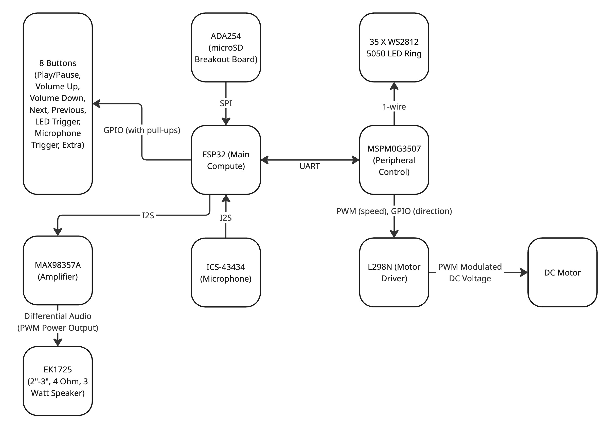

# Spinning Cat Speaker

A rhythm-synchronized speaker system featuring a 3D-printed cat that spins and flashes RGB LEDs in time with music — inspired by [this video](https://www.youtube.com/watch?v=IxX_QHay02M).

**Group Members:** Katherine Han, Evan Ho, Hajime Kioi, Winson Lin

---

## Overview

The Spinning Cat Speaker is a custom-built embedded audio system that plays music while driving a DC motor to spin a 3D-printed cat figurine in sync with the beat. An RGB LED ring mounted on the assembly pulses with the music for a visual effect that complements the audio.

The system is powered via a 5V USB connection and streams audio and motor movement data concurrently from a microSD card. Physical buttons allow the user to cycle through tracks, control playback, and trigger LED effects.

---

## Features

- Music playback from microSD card over I2S to a Class D amplifier
- Motor speed and direction synchronized to music rhythm
- 35-LED WS2812 RGB ring with programmable lighting effects
- Microphone input for audio-reactive modes
- 8-button interface: Play/Pause, Volume Up/Down, Next, Previous, LED Trigger, Microphone Trigger, and a spare
- 5V USB powered

---

## System Architecture

The system is built around two microcontrollers:

- **ESP32** (Main Compute) — handles audio decoding and playback, microSD streaming via SPI, I2S audio output to the amplifier and input from the microphone, button input handling, and I2C communication to the peripheral controller.
- **MSPM0G3507** (Peripheral Control) — receives commands from the ESP32 over I2C and drives the motor via PWM/GPIO to the L298N motor driver, and controls the WS2812 LED ring over a 1-wire interface.

### Component Summary

| Component | Role |
|---|---|
| ESP32 | Main compute: audio, SD, buttons, I2C master |
| MSPM0G3507 | Peripheral control: motor, LEDs (I2C target) |
| ADA254 (microSD Breakout) | Music and movement file storage (SPI) |
| ICS-43434 | MEMS microphone (I2S) |
| MAX98357A | I2S Class D amplifier |
| EK1725 (2"–3", 4Ω, 3W) | Speaker |
| L298N | DC motor driver (PWM + GPIO direction) |
| DC Motor | Spins the cat |
| 35x WS2812 5050 LED Ring | RGB lighting effects (1-wire) |
| 8 Buttons | User input (GPIO with pull-ups) |

### System Diagram

---

## Power

The entire system is powered from a single **5V USB** connection.
